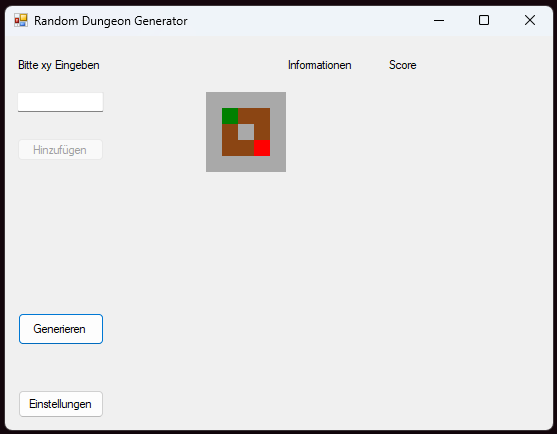

# RandomDungeon_V2

Das Random Dungeon Projekt, jetzt in WindowsForms.  
Wie beim ersten [Random Dungeon Generator](https://github.com/lennoxMurg/RandomDungeonGenerator_RDG) wird ein Dungeon generiert

----

## Hier zu den wichtigen dokumentationen

- [Informationen.md](Docs/Infos.md)  
  Für allgemeine informationen zum projekt

- [TODO.md](Docs/TODO.md)  
  Für geplante features, fixes & Updates

- [Sprites.md](Docs/Sprites.md)  
  Für eine detilierte übersicht aller sprites und texturen

----

## Das team

Das team aus  der I12-F2 des [Adolf-Kolping-Berufskollegs](https://www.akbk-horrem.de) besteht aus drei mitgliedern:

- Hakan

- Lars

- Lennox    - __Gruppenleiter__  

  Und es heißt: __"Semicolon-Sheriffs"__

## Das Spiel

- Hier is ein einblick in das Spiel am anfang der Entwicklung mit einer PictureBox als renderer des Dungeons  

